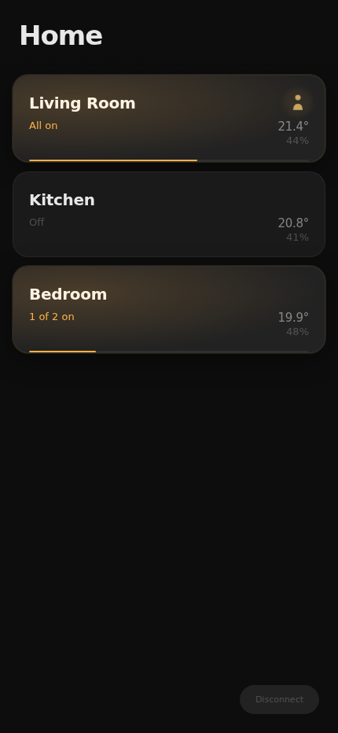
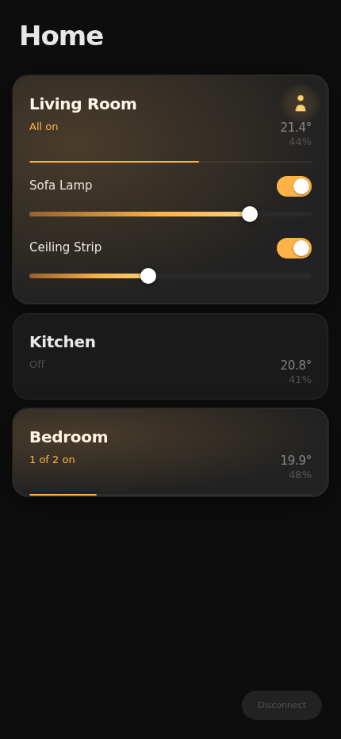

# SmartHue
SmartThings but with the Philips HUE experience; this repository tries to replicate a smooth philips hue apperance, function and philosophy for lights i smartthings. 

It has one focus; to be the most enjoyable "daily-driver" app for smartthings. 

## Run locally with mock SmartThings data

```bash
npm install
npm run dev
```

Then open `http://localhost:5174/?mock=1` to bypass the token screen and load the built-in fake SmartThings home used for the example screenshots below.

## PWA cache reset

If an older installed PWA is stuck on stale assets, this build now performs a one-time service worker and cache reset the first time the updated app loads.

If a client is still trapped on an older worker and will not update, deploy one temporary reset release:

```bash
npm run build:pwa-reset
```

Publish that build once, let affected clients open the app so the old worker unregisters and clears caches, then publish the normal build again:

```bash
npm run build
```

For a manual client-side reset after this change is deployed, open the app with `?reset-pwa=1` once.

## Run in a devcontainer

Open the repository in the included devcontainer to get a ready-to-use Node development environment inside VS Code. The container forwards the Vite dev server on port `5174` and installs dependencies automatically.

## Example screenshots

### Mock home overview



### Mock room details


