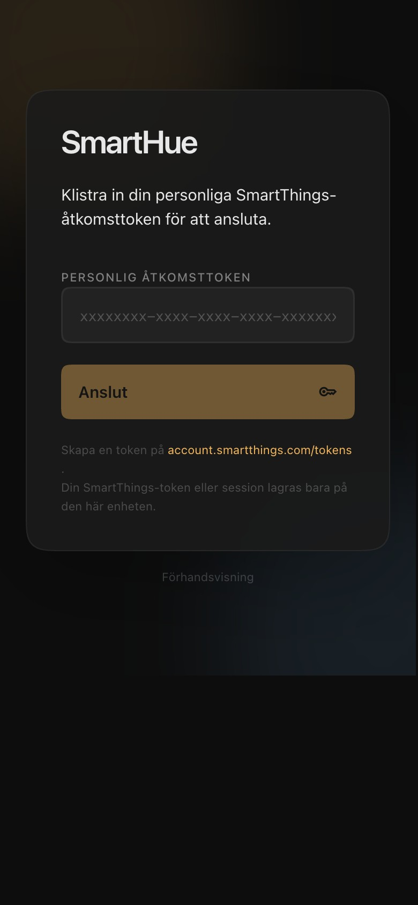
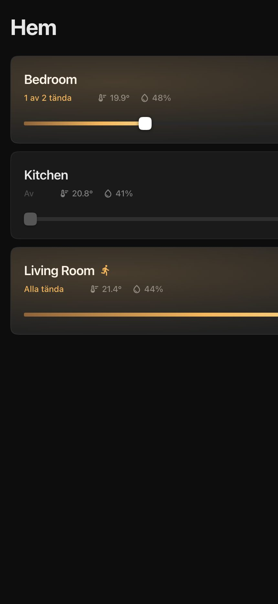
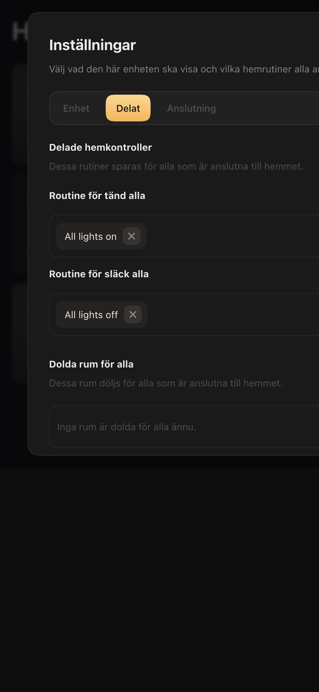
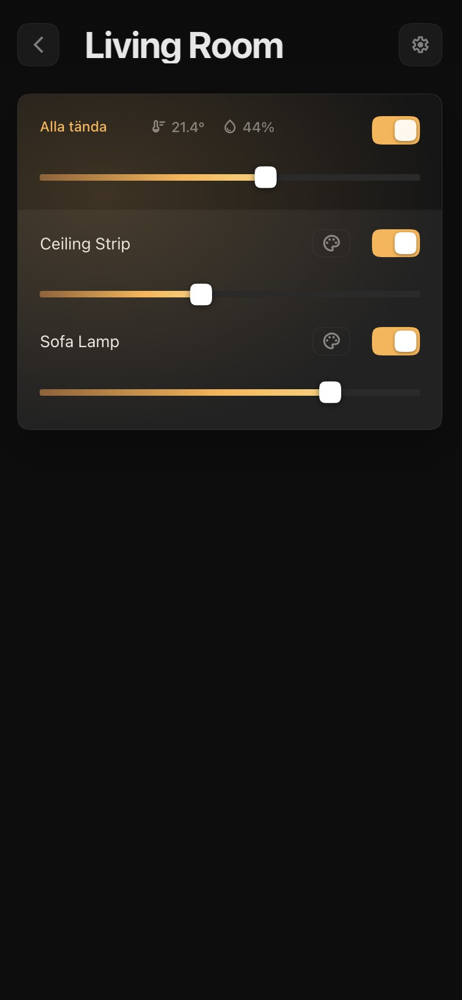
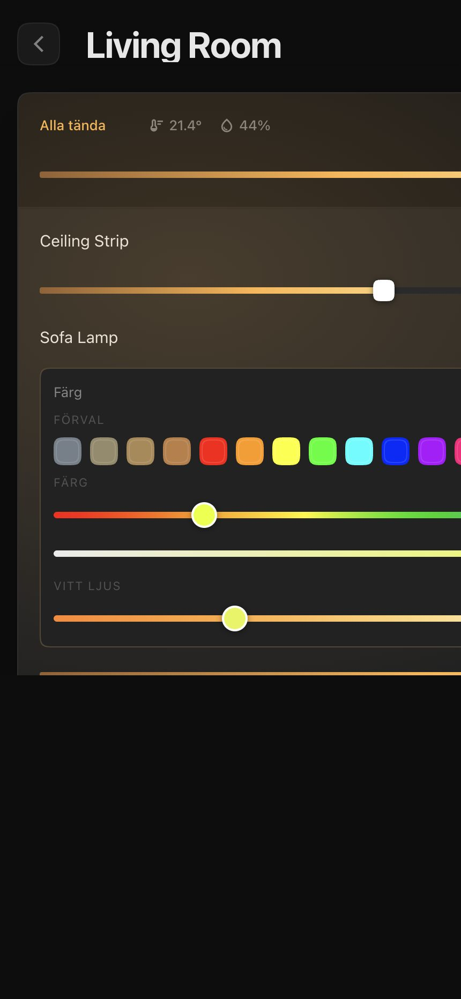
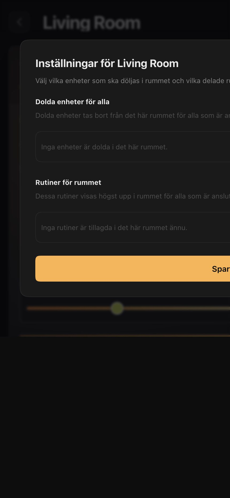

# SmartHue

SmartHue is a SmartThings lighting app built around the interaction model and polish expectations of Philips Hue.

The project goal is not to expose every SmartThings capability. The goal is to make daily lighting control feel immediate, calm, and reliable on a wall-mounted tablet, phone, or installed PWA.

That means the product is intentionally opinionated:

- touch-first over admin-first
- optimistic UI over spinner-heavy UI
- room-level control over device-list overload
- polished transitions and feedback over raw data density
- a strong installed-PWA experience over browser-tab ergonomics

## What SmartHue is optimizing for

SmartHue is being built as a daily-driver home lighting app.

Core product goals:

- Make common lighting actions feel instant through optimistic updates and local state reconciliation.
- Keep the UI visually polished and easy to read from across a room.
- Prefer room context over generic dashboards.
- Work well as an installed PWA on mobile devices.
- Handle SmartThings OAuth in a way that survives real mobile handoff and resume behavior.
- Keep shared household settings simple enough that non-technical users can trust them.

Non-goals, at least for now:

- Full SmartThings capability coverage.
- A generic automation builder.
- A desktop-first enterprise control panel.
- A perfect clone of the official Hue app.

## Current capabilities

### Home and room control

- Room list with room-level status.
- Aggregated room climate when SmartThings exposes temperature and humidity sensors.
- Room-level on and off actions.
- Room-level brightness control.
- Swipe-back gesture from room detail views.

### Light control

- Per-light on and off actions.
- Per-light brightness sliders.
- Palette-driven color controls for supported lights.
- Hue slider.
- Saturation slider.
- White temperature slider for temperature-only lights.
- Unified presets that can apply hue, saturation, and Kelvin together where supported.
- Immediate local preview during slider interaction with debounced command sending.

### Shared home configuration

- Shared main routines for global “turn all on” and “turn all off” actions.
- Shared room routines pinned at the top of a room.
- Shared per-room hidden device lists.
- Shared home configuration backed by Upstash-compatible storage through the service layer.

### Device-local configuration

- Hidden rooms stored only on the current device.

### Auth and session handling

- SmartThings OAuth login with a broker-backed code exchange.
- Refresh-token-based session renewal.
- Installed-PWA-safe login resume flow using a relay session.
- Proactive foreground refresh for OAuth sessions before expiry, including checks on focus, visibility return, pageshow, online, and while the app remains open.

### Packaging and runtime

- Installable PWA with service worker updates.
- One-time PWA cache reset migration support and emergency reset build.
- Capacitor scaffold for future iOS and Android wrappers.

## Product principles

These principles should guide feature work and contributions:

### 1. Optimistic by default

If the user drags a dimmer or changes a color, the interface should respond immediately. Network confirmation should reconcile state, not gate the interaction.

### 2. Polished over busy

A smaller number of well-finished controls is better than exposing every edge-case capability in one screen.

### 3. Room context first

Users usually think in terms of rooms, scenes, and quick lighting outcomes, not device IDs and raw capabilities.

### 4. Installed PWA matters

The app should feel good when launched from the home screen, and auth and session behavior must be designed for that reality.

### 5. Shared settings should be understandable

If a setting affects all users in a home, that should be obvious from the UI and the implementation.

## Tech stack

- Frontend: Lit, Vite, Sass
- PWA: `vite-plugin-pwa` with Workbox
- SmartThings integration: browser client plus broker-backed OAuth/token refresh
- Shared configuration storage: Upstash Redis REST or compatible KV via the service layer
- Native wrapper prep: Capacitor for iOS and Android

## Architecture overview

### Frontend app

The main frontend lives under `src/` and is built as a single-page app.

Important areas:

- `src/services/backend.js`: injectable backend provider facade that keeps the UI and store decoupled from a specific smart home adapter
- `src/components/app-shell.js`: app bootstrap, auth handoff, app-level transitions
- `src/components/home-view.js`: home view, room detail, settings surfaces, routines, swipe-back behavior
- `src/components/light-group.js`: per-light controls including dimming, color, saturation, and white temperature
- `src/services/store.js`: optimistic client state, debounced device commands, shared and home config updates
- `src/services/smartthings.js`: SmartThings API client, OAuth session logic, broker communication
- `src/services/normalizer.js`: raw SmartThings payload normalization into the app’s room and light model

### OAuth broker

The browser cannot safely exchange a SmartThings OAuth code by itself because SmartThings requires a `client_secret`.

This repo includes a broker that handles:

- OAuth code exchange
- refresh-token exchange
- pending relay session status
- shared home config endpoints

The broker code lives in `api/` and can be run locally or deployed separately.

### Backend providers

The app now resolves backend behavior through `src/services/backend.js`.

That keeps login, token/session handling, and device operations injectable so additional smart home adapters can register themselves without rewriting app-shell or store logic. SmartThings remains the default registered provider.

### Shared home config model

Shared household state is intentionally narrow and explicit:

- main routines
- hidden shared rooms
- per-room hidden device IDs
- per-room routine IDs

That shared state is separate from device-local preferences like hidden rooms on just one tablet or phone.

## SmartThings OAuth flow

The current login flow is designed to work in installed PWAs on mobile:

1. The app requests `/auth/start` from the broker.
2. The broker returns a SmartThings authorization URL.
3. SmartThings redirects back to the broker callback.
4. The broker exchanges the code server-side.
5. The app resumes by polling `/auth/status/:sessionId` until the relay session completes or fails.

This avoids relying entirely on a direct redirect back into the app shell, which is not trustworthy enough on mobile home-screen installs.

If no OAuth frontend configuration is present, the app falls back to the legacy Personal Access Token flow.

## Running locally

### Prerequisites

- Node.js and npm
- A SmartThings OAuth app if you want live login
- For native wrapper work later:
	- macOS and Xcode for iOS
	- Android Studio and Android SDK for Android

### Mock mode

```bash
npm install
npm run dev
```

Open:

```bash
http://localhost:5174/?mock=1
```

Mock mode is the fastest way to iterate on UI and interaction work.

### Live SmartThings OAuth

1. Create a local `.env` from `.env.example`.
2. Configure the frontend env vars.
3. Start the local broker.
4. Start the frontend.

Example:

```bash
npm install
npm run auth:broker
npm run dev
```

Open:

```bash
http://localhost:5174/
```

## Frontend environment variables

Expected frontend env vars:

```bash
VITE_SMARTTHINGS_AUTH_URL=https://auth.domain.tld
VITE_SMARTTHINGS_SERVICE_URL=https://service.domain.tld
VITE_SMARTTHINGS_SCOPES=r:locations:* r:devices:* x:devices:* r:scenes:* x:scenes:*
```

Production intent:

- `auth.domain.tld` for OAuth and token relay endpoints
- `service.domain.tld` for shared home-config endpoints

If only one of those env vars is set and it uses the `auth.` or `service.` naming convention, the app derives the other automatically.

The older `VITE_SMARTTHINGS_BROKER_URL` variable is still supported as a fallback.

For local development, you can point both `VITE_SMARTTHINGS_AUTH_URL` and `VITE_SMARTTHINGS_SERVICE_URL` to `http://localhost:8787`.

## Broker configuration

The broker can run locally via:

```bash
npm run auth:broker
```

Example local env:

```bash
SMARTTHINGS_CLIENT_ID=your-smartthings-client-id \
SMARTTHINGS_CLIENT_SECRET=your-smartthings-client-secret \
SMARTTHINGS_ALLOWED_ORIGINS=http://localhost:5174 \
npm run auth:broker
```

For deployed environments, the broker can be hosted separately from the frontend, for example with Vercel.

Useful broker env vars:

```bash
SMARTTHINGS_CLIENT_ID=your-smartthings-client-id
SMARTTHINGS_CLIENT_SECRET=your-smartthings-client-secret
SMARTTHINGS_ALLOWED_ORIGINS=https://your-frontend-domain.com
SMARTTHINGS_TOKEN_URL=https://api.smartthings.com/oauth/token
KV_REST_API_URL=https://your-upstash-rest-url
KV_REST_API_TOKEN=your-upstash-rest-token
```

Alternative Upstash naming also works:

- `UPSTASH_REDIS_REST_URL`
- `UPSTASH_REDIS_REST_TOKEN`

Current public broker route contract:

- `/auth/start`
- `/auth/callback`
- `/auth/status/:sessionId`
- `/smartthings/exchange`
- `/smartthings/refresh`
- `/home-config/:locationId`
- `/health`

Important detail: the SmartThings OAuth redirect URI should point to the broker callback, not directly to the frontend.

## Build, preview, and maintenance scripts

### Frontend and PWA

- `npm run dev`: start the Vite dev server
- `npm run build`: production build plus deployment checks
- `npm run preview`: serve the built app locally
- `npm run lint`: run ESLint
- `npm run build:pwa-reset`: build an emergency self-destroying service worker release

### Capacitor

- `npm run build:native`: build the web app and sync Capacitor assets
- `npm run cap:add:android`: create the Android project
- `npm run cap:add:ios`: create the iOS project
- `npm run cap:copy`: copy web assets into native projects
- `npm run cap:sync`: sync web assets and plugin config
- `npm run cap:open:android`: open the Android project in Android Studio
- `npm run cap:open:ios`: open the iOS project in Xcode

## PWA behavior

The app is configured as an installable PWA and ships with a service worker.

Notable behavior:

- manual service worker registration
- runtime caching for same-origin assets and bounded SmartThings API responses
- one-time client migration reset support
- emergency self-destroying worker for stuck legacy clients

If a client is trapped on an old worker, deploy one temporary reset release:

```bash
npm run build:pwa-reset
```

After affected devices open that build once, deploy the normal build again:

```bash
npm run build
```

Manual client-side reset after deployment:

```bash
?reset-pwa=1
```

## iPhone and installed-PWA usage

SmartHue is already configured for Home Screen install on iPhone.

Install path:

1. Open the app in Safari.
2. Tap `Share`.
3. Tap `Add to Home Screen`.

The login and setup screen includes a Safari-only install hint when the app is not yet running in standalone mode.

Newer iOS releases support installed web apps and web push, but they still do not provide Periodic Background Sync or arbitrary background service worker execution for scheduled token refresh. SmartHue therefore refreshes OAuth sessions proactively while the app is open/foregrounded and immediately checks again when the installed app is resumed.

This is currently the best no-Apple-fee route for a real app-like iPhone experience.

## Native wrapper status

This repo is prepared for future native shells via Capacitor, but it does not include generated `ios/` or `android/` projects yet.

That is deliberate. The scaffold is in place, but the actual native projects should usually be generated when someone is ready to open them in Xcode or Android Studio.

See `docs/ios-distribution-audit.md` for the current iOS distribution constraints and blocker list.

## Roadmap

The roadmap is intentionally product-focused rather than release-number-focused.

### Near term

- Continue polishing installed-PWA behavior on iPhone and Android.
- Validate OAuth and return and resume behavior inside real Capacitor shells.
- Improve native-wrapper readiness with real generated Android and iOS projects when packaging work starts.
- Add more operational documentation for deployment and recovery.

### UI and interaction polish

- Keep refining room transitions, touch feedback, and panel ergonomics.
- Expand color and white controls only where the experience remains clear and compact.
- Improve feedback for pending, failed, and recovered device commands without losing immediacy.

### Smart home feature depth

- Broaden shared home settings where they stay understandable to non-technical users.
- Improve routine handling and quick actions.
- Continue capability support for real-world light variations and edge cases.

### Native packaging

- Generate and validate Capacitor Android and iOS projects.
- Test auth resume behavior in wrapped builds.
- Prepare store and marketplace metadata, assets, and policy review material.

### Quality and maintainability

- Strengthen targeted tests around normalization, store behavior, and auth and session flows.
- Keep the shared config contract small, explicit, and well-documented.
- Preserve fast feedback loops for UI work with mock data.

## Contributing

Contributions are welcome, but they should respect the product direction.

Before contributing, align with these expectations:

- Prefer focused changes over large rewrites.
- Preserve the touch-first, low-friction UI direction.
- Do not add raw complexity just because SmartThings exposes it.
- Keep optimistic interactions immediate.
- If a feature affects all users in a home, make that explicit in both UI and implementation.

### Good contribution areas

- UI polish and interaction refinement
- real-device edge cases for lights and room control
- auth and installed-PWA reliability improvements
- documentation and deployment clarity
- small, targeted architecture cleanup that preserves behavior

### Contribution workflow

1. Fork the repo or create a feature branch.
2. Use mock mode for quick UI iteration whenever possible.
3. Keep changes scoped to one problem or feature.
4. Validate your work before opening a PR.
5. Explain user-facing behavior changes clearly in the PR description.

### Recommended validation

At a minimum, run:

```bash
npm run lint
npm run build
```

If your change touches auth, session handling, service worker behavior, or installation flows, also describe how you tested those paths.

### Design guidance for contributors

- Favor intentional, polished surfaces over generic settings screens.
- Avoid cluttering the home screen with low-value controls.
- Keep room actions fast and obvious.
- Do not regress gesture safety around sliders and dimmers.
- Avoid introducing lag in the UI while waiting for network round-trips.

### Code guidance for contributors

- Follow the existing Lit component patterns.
- Keep shared config logic in the service and store layer, not scattered across UI code.
- Preserve the normalized room and light model shape unless there is a strong reason to change it.
- Prefer minimal public API changes.

## Limitations and known constraints

- Offline SmartThings devices are intentionally hidden from the UI.
- Live OAuth requires a secure broker; GitHub Pages alone is not enough.
- iOS App Store distribution still requires Apple participation.
- Aptoide iOS or other alternative marketplaces should not be treated as a simple no-fee bypass.
- Native packaging cannot be fully completed from this Linux dev container.

## Dev container

This repository includes a dev container for VS Code.

It provides a ready-to-use Node environment and forwards the Vite dev server on port `5174`.

## Screenshots

All screenshots below are captured from the current app using built-in mock data and the live setup screen.

### Token setup



### Home overview



### Shared home settings



### Room detail



### Expanded light controls



### Room settings


